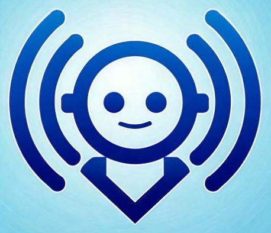
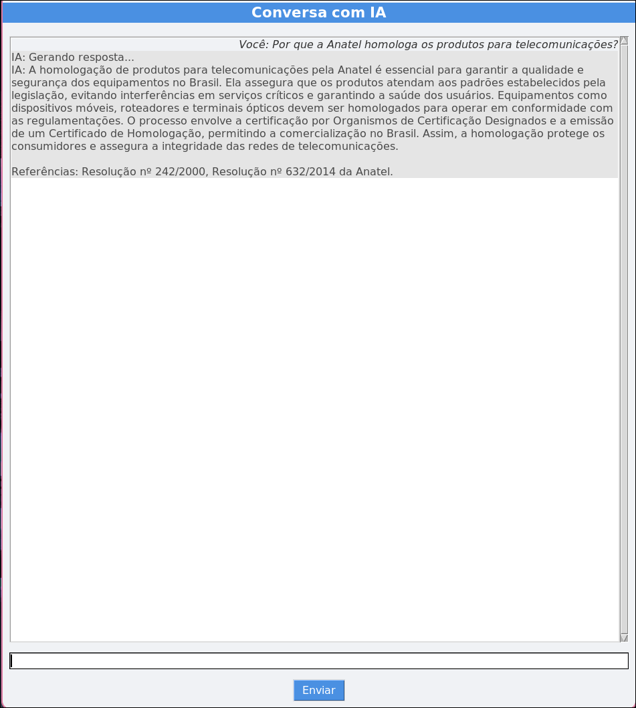
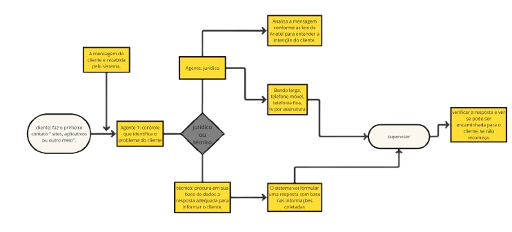

# ChatBot Telecomunicacao
Trabalho final do curso de telecomunicações, um chatbot para auxiliar a resolver problemas de clientes de telecomunicações. <br>

## Como instalar
Baixe as suas chaves, uma para pesquisa, como a da Serper, e uma para a ia, OpenAI, Llama...
```
pip install crewai==0.28.8 crewai_tools==0.1.6 langchain_community==0.0.29
```
### Imagem do chatbot


### Fluxograma do funcionamento dos agentes de IA


1. Agente identificador de problema categoriza entre jurídico ou técnico e encaminha para o próximo agente.
2. Agente jurídico é responsável pelos problemas jurídicos, dúvidas gerais da Anatel e sobre as normas e leis.
3. Agente técnico é responsável pelos problemas técnicos, datasheets de equipamentos.
4. Agente supervisor revisa o texto gerado pelos agentes anteriores para retornar ao cliente.
